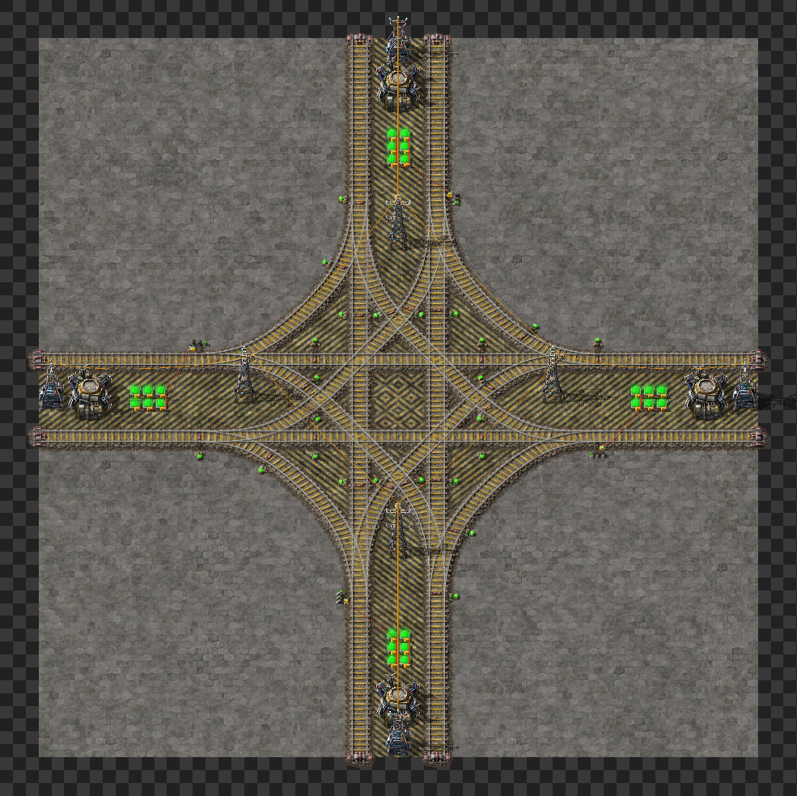

# Project 68^2
Project 68^2 is my train based city block system. Im learnig how to use trains so bare with me :)

## City block components:
Heavily inspired by Leading-Medias-4569 base posted on reddit. Same block size and setup, just adapted for rigth hand train usage.
Link to profile: https://www.reddit.com/user/Leading-Media-4569/

### BP book
[CityBlockBP](CityBlocks/CityBlocks)  

### Straigth piece 
Used for linking turns or junctions.
  
[StraigthBP](CityBlocks/straigth)

### Bridging
Used for merging city blocks when used with one straigth piece in each end.

[BridgeBP](bridge)

### Turn
   
 [TurnBP](CityBlocks/turn)

### Junction
  
[JunctionBP](CityBlocks/junction)

### T-junction
  
[T-junctionBP](CityBlocks/t-junction)

## Train Loading Bays

###

## Train Unloading Bays

###
