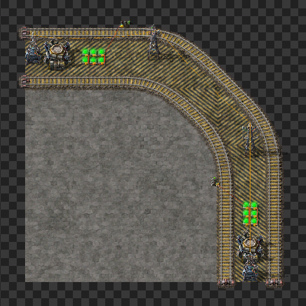
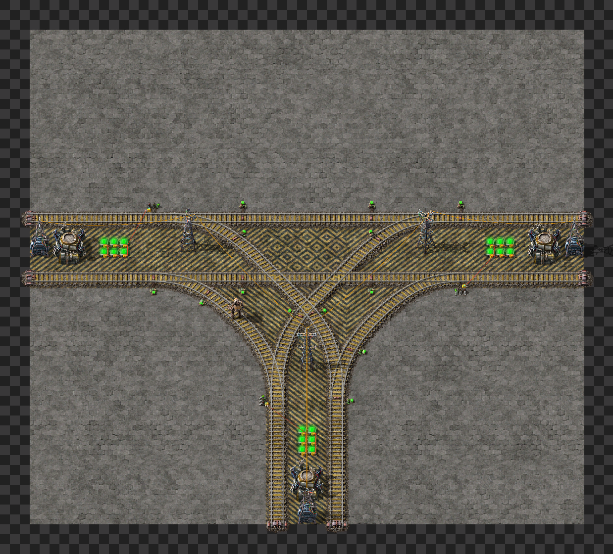

# Project 68^2
Project 68^2 is my train based city block system. Im learnig how to use trains so bare with me :)

## City block components:
Heavily inspired by Leading-Medias-4569 base posted on reddit. Same block size and setup, just adapted for rigth hand train usage.
Link to profile: https://www.reddit.com/user/Leading-Media-4569/

## BP book
[CityBlocks](CityBlocks)

### Straigth piece 
Used for linking turns or junctions.

[CityBlocks](straigth)

### Bridging
Used for merging city blocks when used with one straigth piece in each end.

[CityBlocks](bridge)

### Turn
 
 [CityBlocks](turn)

### Junction

[CityBlocks](junction)

### T-junction

[CityBlocks](t-junction)

