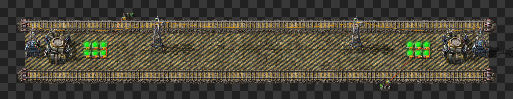
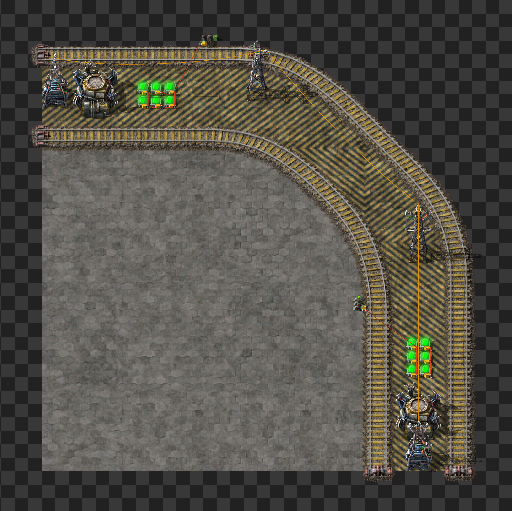
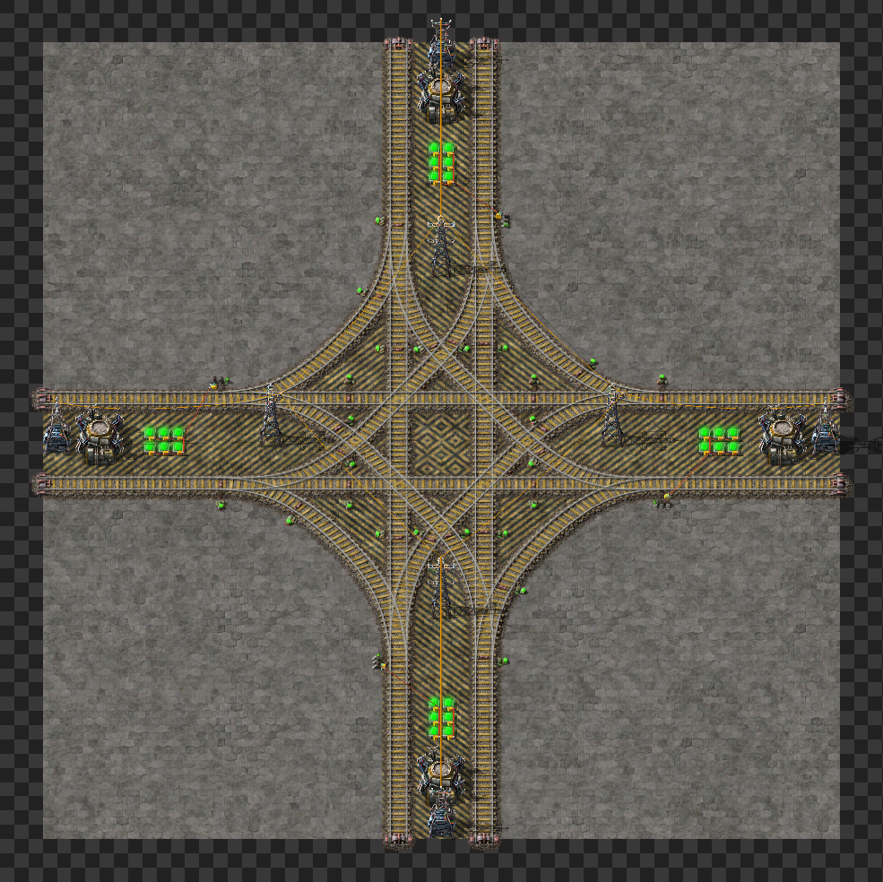
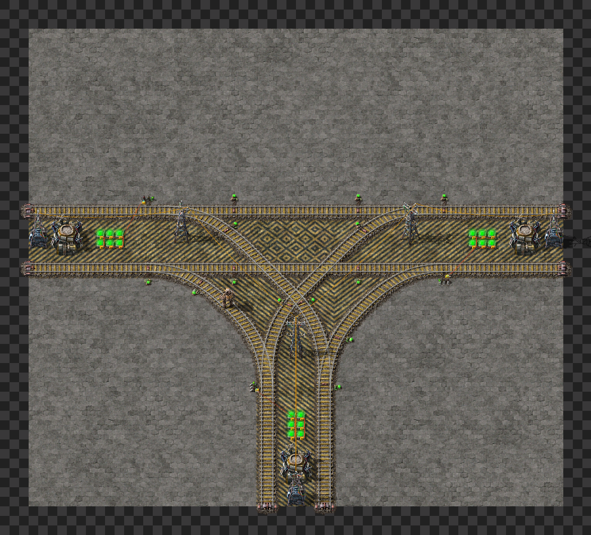

# Factorio
Just my shitty personal blueprints often heavily inspired by others
Us at own risk :)

# 68^2
Project 68^2 is my train based city block system. Im learnig how to use trains so bare with me :)

## City block components:
Heavily inspired by Leading-Medias-4569 base posted on reddit. Same block size and setup, just adapted for rigth hand train usage.
Link to profile: https://www.reddit.com/user/Leading-Media-4569/
### Straigth piece 

68^2/CityBlocks/straight

### Bridging
Used for merging city blocks

### Turn

### Junctions

